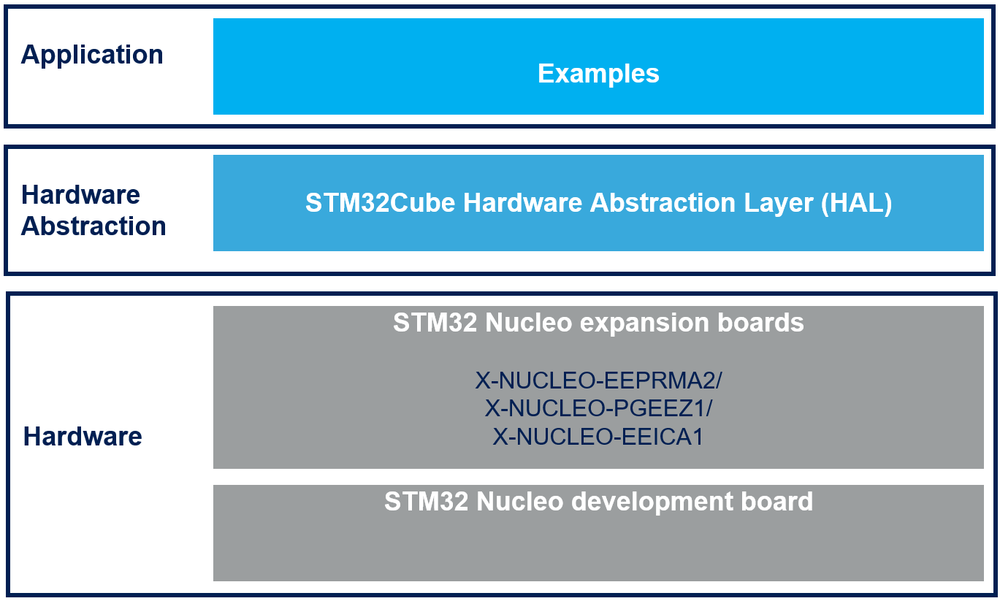

# X-CUBE-EEPRMA1 Firmware Package

The X-CUBE-EEPRMA1 software expansion for STM32Cube provides an evaluation software example for M24XX I²C, M95XX and M95P32 SPI EEPROMs. It is built on top of STM32Cube software technology to ease portability across different STM32 microcontrollers.

**X-CUBE-EEPRMA1 software features**:

- Complete software to build applications using M24XX, M95XX or M95P32 series based EEPROM.
- Sample implementation available on the X-NUCLEO-EEPRMA2 and X-NUCLEO-PGEEZ1 expansion boards plugged to a NUCLEO-F401RE, NUCLEO-G474RE, NUCLEO-L053R8 or NUCLEO-H743ZI development board.
- Easy portability across different MCU families thanks to STM32Cube.
- Free, user-friendly license terms.
- Package compatible with STM32CubeMX (X-NUCLEO-EEPRMA2 and X-NUCLEO-PGEEZ1), can be downloaded from and installed directly into STM32CubeMX.

The figure below shows the overall architecture.

- At the bottom layer there are the HW components: the STM32 MCU, as well as M24, M95 and M95P32 series based EEPROM.  
- The drivers abstract low level details of the hardware and allow the application software to provide M24xx, M95xx and M95P32 series based EEPROM features in a hardware independent fashion.
- The applications provide examples of how to use the code.

**Related information and documentation**:

- [UM2481](https://www.st.com/resource/en/user_manual/dm00544171-getting-started-with-the-xcubeeeprma1-software-expansion-for-stm32cube-stmicroelectronics.pdf): Getting started with the X-CUBE-EEPRMA1 software expansion for STM32Cube
- [STM32Cube](http://www.st.com/stm32cube)
- [STM32 Nucleo boards](http://www.st.com/stm32nucleo)
